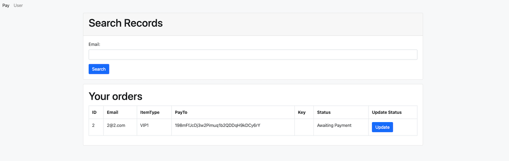

# BitGate-Free-Bitcoin-Crypto-Payment-Gateway
BitGate is a Bitcoin crypto payment PHP gateway, 
*Free, 
*Open Source, 
*No KYC, 
*PHP with Sqlite database, 
*No need install bitcoin core, 
*Funds store to your cryptocurrency key directly, 
*Full control.. 

#### index.php 
>to accept payment

#### search.php
>user check their order

#### data.php
>admin check all of the order

 
The principle of the software is to generate different private keys and bind the user's order. Once it detects that the address has received payment, it will perform corresponding database operations, such as upgrading the level, recharging, displaying the activation code, etc. The private key is encrypted and stored in the database, and only the administrator can view it. In the whole process, only the third-party API is needed to check the balance of the address, and there are so many such APIs on the Internet.

 

 
 
